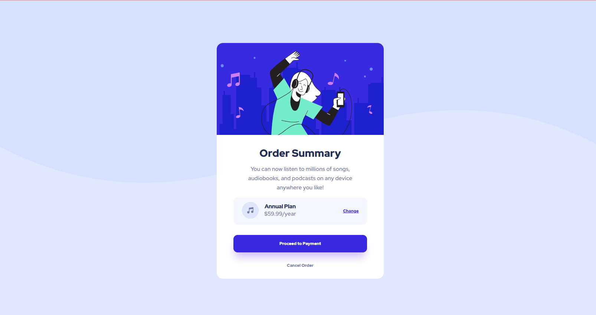

# Frontend Mentor - Order summary card solution

## Welcome! 👋

Thanks for checking out this front-end coding challenge.

## The challenge

This challenge is to build out this order summary card component and get it looking as close to the design as possible.

The users should be able to:

- See hover states for interactive elements

### Screenshot



### Links

- Solution URL: [GitHub](https://github.com/iEerii/orderSummary)
- Live Site URL: [Netlify](https://ordersummarychallenge2.netlify.app/)

## My process

### Built with

- Semantic HTML5 markup
- CSS custom properties
- Flexbox

### What I learned

I learned how to apply relative unit rem 

```css
.html {
  font-size: 62.5%;
}

h1{
    font-size: 1.2rem; 
}

p{
    font-size: 2.4rem; 
}
```

## Author

- Frontend Mentor - [@iEerii](https://www.frontendmentor.io/profile/iEerii)
